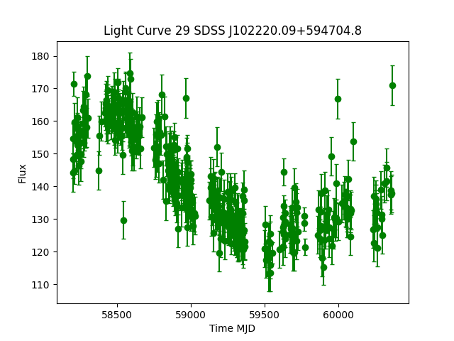
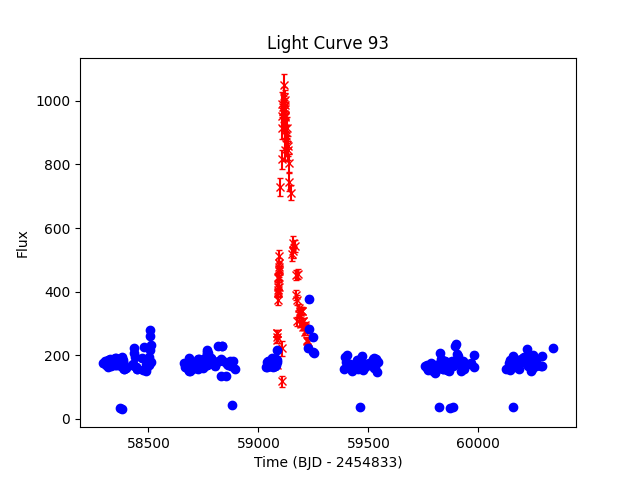
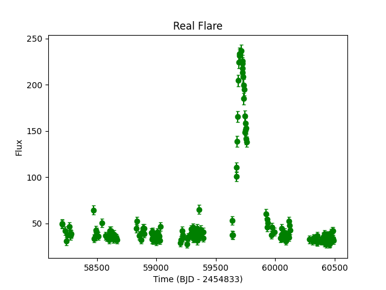
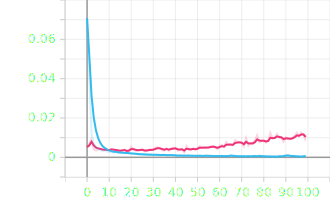
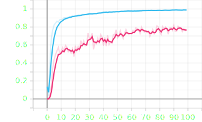
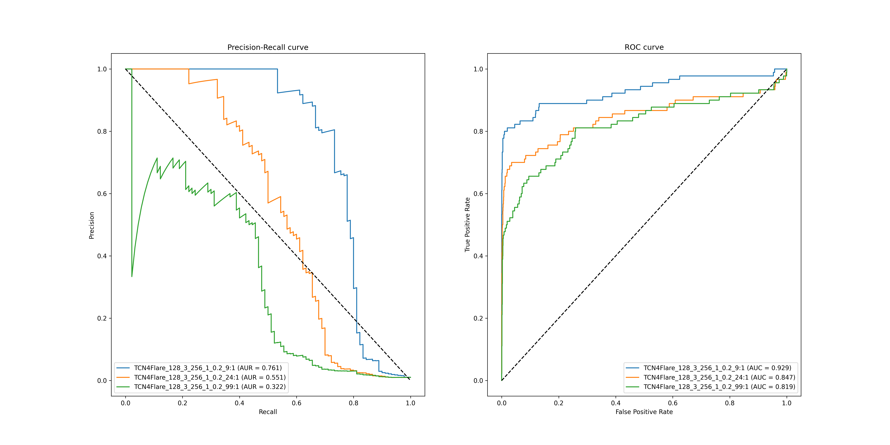
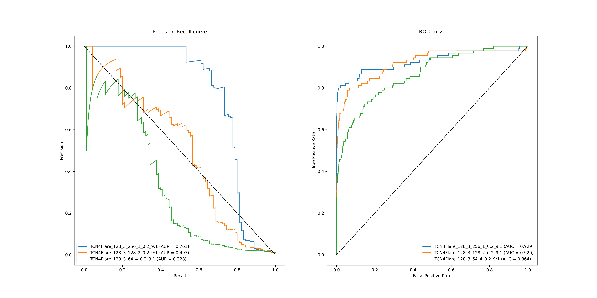
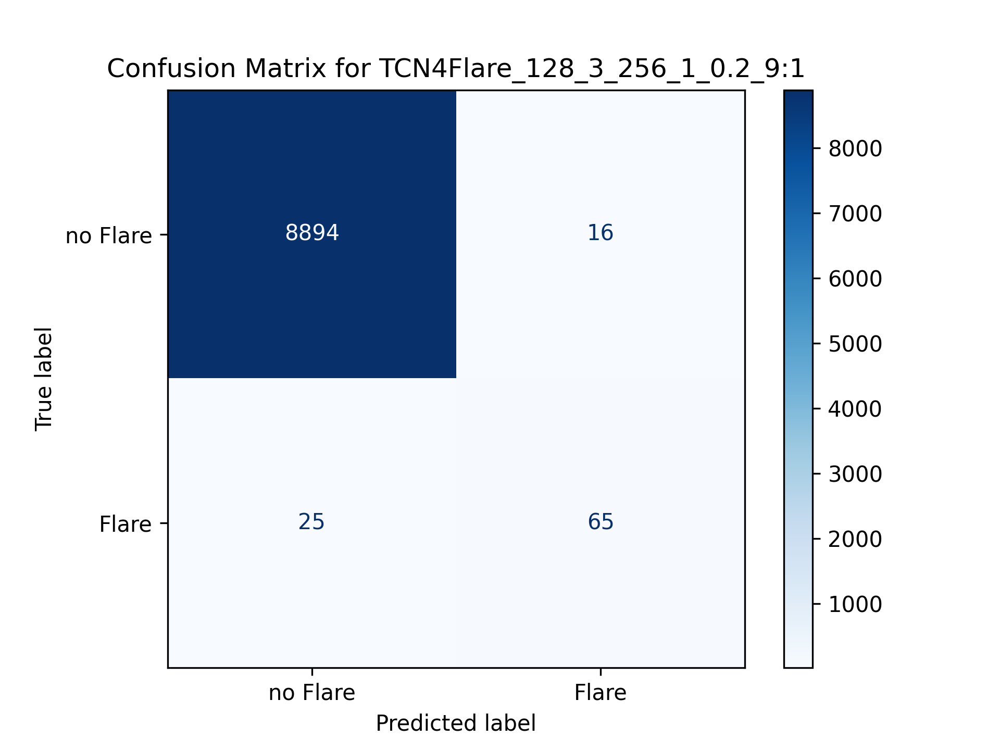

# TCN4Flare

## 1. Introduction
This is the official implementation of the TCN4Flare model.  
This model is based on the Temporal Convolutional Network (TCN) architecture and is specifically designed for the detection of flares in the light curves of AGNs.  

## 2. Model Architecture
The TCN4Flare model is a TCN model, using the keras-tcn (3.5.4) python package. The detailed architecture of the model can be seen in https://github.com/philipperemy/keras-tcn.

Some important arguments used in the TCN4Flare model are:
- input_shape: the shape of the input light curve. (None, None, 2)
- nb_filters: the number of filters in the convolutional layers. Fault is 128.
- kernel_size: the size of the convolutional kernel. Fault is 3.
- dilations: the list of the dilations used in the convolutional layers. Fault is [1, 2, 4, 8, 16, 32, 64, 128, 256].
- nb_stacks: the number of stacks of TCN layers. Falut is 1.
- return_sequences: False
- activation: the activation function used in the TCN layers. Fault is 'sigmoid'.
- dropout_rate: the dropout rate used in the TCN layers. Fault is 0.2.
- kernel_initializer: the kernel initializer used in the TCN layers. Fault is 'he_normal'.
- use_layer_norm=True.
- use_skip_connections=True.

## 3. Datasets
To detect flares in the light curves of AGNs, we need two kinds of data: LCs with and without flares.

### 3.1 LCs without flares
We use Zwiciky Transient Facility (ZTF) public data of AGNs as raw data. Firstly, we use traditional methods (**To be added**) to detect flares of these raw LCs and get LCs which are considered as no-flare by the flare-detection algorithm. Then we checked these LCs manually. Finally, we get a dataset of LCs without flares.  
An example of a no-flare LC is shown below:  

### 3.2 LCs with flares
Using the dataset without flares, we manually insert flares into the LCs. We use the same traditional flare-detection algorithm as the previous step to get the LCs with flares. And we checked these LCs with huamn-made flares manually. Finally, we get a dataset of LCs with artifical flares.
The artifical flares are generated from Gamma distribution with the following parameters:
- peak mag: uniformly distributed between 0.5 and 2.0.
- start time: uniformly distributed between 0 and 0.8*t_max days.
- duration: uniformly distributed between 15 and 300 days.
- shape of Gamma distribution: alpha is choosed from [2, 3, 4] randomly.

An example of a LC with artifical flares is shown below:
  
*Note: The red dots represent flux with inserted flare(3-sigma), the blue dots represent the original flux.*

### 3.3 Train dataset
We combine the above two datasets to get the train dataset. We generate 3 kinds of train datasets with different class ratio: 1:9, 1:24, and 1:99. Using these datasets, we can know the impact of class imbalance on the model performance.

### 3.4 Validation dataset and Test dataset
We have got about 100 LCs with real confirmed flares from the ZTF public data of AGNs.(*Paper preparing*) So we combine these LCs with the LCs without flares to get the validation dataset and the test dataset. The validation dataset is used to choose the best model during the training process, and the test dataset is used to evaluate the final performance of the model. Due to the limited number of LCs with real flares, the validation and test datasets are the same.  
An example of LC with real flares is shown below:  

## 4. Preprocessing
The input data of TCN model must have the same time interval. So we have to preprocess the LCs to have the same time interval. We use Gaussian Process (GP) to fit the LCs and interpolate the LCs with 1 day time interval.  
The train dataset, validation dataset, and test dataset are all composed of LCs after GP interpolation.
An example of GP fitted LCs is shown below:(**To be added**)

## 5. Training
We use the train dataset to train the TCN4Flare model. We use the validation dataset to choose the best model during the training process. We use the test dataset to evaluate the final performance of the model.

Because of the inbalanced dataset, we use focal loss function with "alpha=the ratio of the number of flares to the total number" and "gamma=3.0".  
We use the NAdam optimizer with a learning rate of 1e-4 and clipnorm=1.0.  
During the training process, we use precision, recall, and F1-score metrics to evaluate the model performance. And we choose the best model with criteria: recall of validation dataset > 0.75 and maximum F1-score of validation dataset.  
We train the model for 100 epochs by default.

We train the model with different arguments (including different dialations, number of stacks, and number of filters) and different datasets to get the best model.
*Note: Different arguments must satisfiy that the recptive field of the model is about the length of the LCs.*

An example of the training process is shown below:  

  

    
    
Epoch Loss

  

  

    
    
Epoch F1 Score

  

## 6. Evaluation
We evaluate the model performance on the test dataset. We use the precision, recall, and F1-score metrics to evaluate the model performance. We also use the confusion matrix to evaluate the model performance.

We compare different models with different arguments and datasets by PR curve and ROC curve. We choose the optimal thereshold to maximize the F1-score and then plot the confusion matrix with the optimal threshold.

## 7. Conclusion
The performance of different models are as below:  

    
    
Models with Different Data Ratio

    
    
Models with Different Arguments

The best model with default arguments is trained on the train dataset with ratio 1:9. This model have a recall of about 0.7 and precision of about 0.8. The confusion matrix shows below: 

    
    
Confusion Matrix

